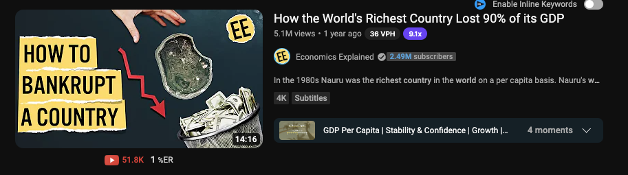
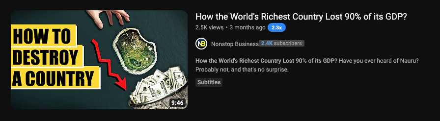
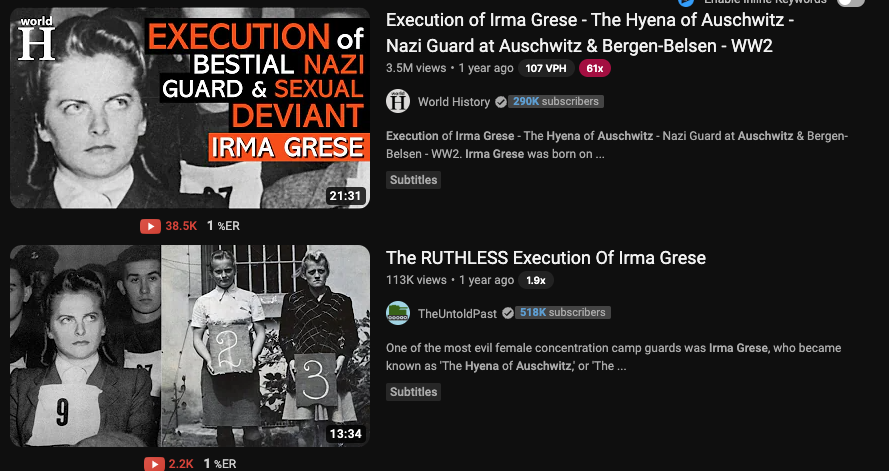
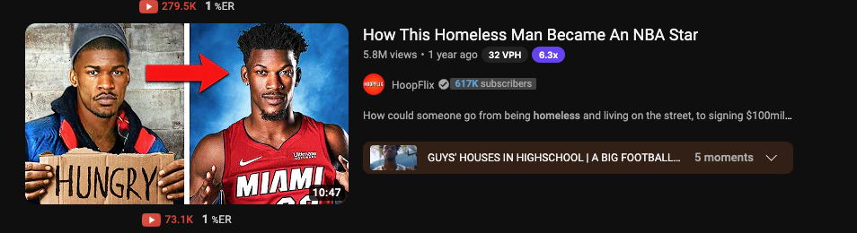

# Modellering kontra kopiering

*Källdokument. PDF inlämnad av Mathias 2026-08-29 (`Kopia av Modelling vs Copying
Examples_ (1).pdf`, 43 sidor, 65 MB — ligger i Downloads, inte i repot). Från Raz & team,
YTA 3.0-programmet. Sida 1 återges ordagrant nedan; resten av dokumentet är 100
skärmbilder.*

---

## Definitionen, ordagrant ur dokumentet

> In the competitive world of YouTube, understanding the distinction between modelling and
> copying is crucial. While copying might seem like a shortcut to success, it often leads
> to disastrous results — low impressions, minimal views, and ultimately, no revenue.
> Conversely, modelling allows you to draw inspiration from successful competitors while
> maintaining your unique voice and brand identity.
>
> **Modelling** involves analyzing the elements that make your competitors' videos
> successful and incorporating those elements into your own way that aligns with your
> content and style. This approach ensures that you are learning and adapting successful
> strategies while staying true to your own brand.
>
> **Copying**, on the other hand, means replicating a competitor's video (i.e. idea, title,
> thumbnail) almost exactly. This not only infringes on their creative property but also
> often results in a lack of authenticity, which can be easily detected by your audience.
> Such inauthenticity can lead to poor performance metrics and ultimately hinder your
> channel's growth.

Dokumentet innehåller **50 modelleringsexempel** (sidorna 2–26, kanalpar med länkar) och
**50 kopieringsexempel** (sidorna 28–43, enbart skärmbilder). Om kopieringsdelen säger
dokumentet: *"Notice how these videos often look uninspired and lack originality. Also
notice the lack of views."*

---

## Beviset — kopiering

Dokumentets första kopieringsexempel, och det tydligaste i hela materialet.

**Originalet — Economics Explained, 2,49 miljoner prenumeranter**

Titel: *How the World's Richest Country Lost 90% of its GDP*
**5,1 miljoner visningar**, 14:16.
Miniatyr: `HOW TO BANKRUPT A COUNTRY` i gul rivpapperstext, en hand, ön Nauru uppifrån,
en papperskorg full av sedlar, röd pil.

**Kopian — Nonstop Business, 2 400 prenumeranter**

Titel: *How the World's Richest Country Lost 90% of its GDP?*
**2 500 visningar**, 9:46.

Titeln är ordagrant densamma så när som på ett tillagt frågetecken. Miniatyren är
återskapad element för element: samma gula rivpapperstext, samma hand, samma ö, samma
sedlar, samma röda pil. **Ett enda ord är utbytt — BANKRUPT till DESTROY.**

Resultat: 5 100 000 mot 2 500.

---

## Beviset — modellering

Samma ämne, helt egen förpackning.

**Originalet — World History, 290 000 prenumeranter**
*Execution of Irma Grese – The Hyena of Auschwitz – Nazi Guard at Auschwitz &
Bergen-Belsen – WW2*, **3,5 miljoner visningar**, 21:31.
Miniatyr: porträttbild med tung flerfärgad textstapel över hela bilden.

**Modelleringen — TheUntoldPast, 518 000 prenumeranter**
*The RUTHLESS Execution Of Irma Grese*, **113 000 visningar**, 13:34.
Miniatyr: **en annan bild helt** (tre kvinnor uppradade med nummerskyltar), **ingen text
alls**, annan komposition.

Samma person, samma händelse, samma nisch. Titeln är kortad från en lång beskrivande
stapel till fem ord med ett laddat adjektiv. Miniatyren delar ingenting med originalet.
Båda videorna fungerar.

Ett andra exempel ur samma sida — HoopFlix, 617 000 prenumeranter,
*How This Homeless Man Became An NBA Star*, **5,8 miljoner visningar**:

Före-och-efter i samma bild med en röd pil emellan. Mekaniken är förvandlingen, inte
motivet — den går att flytta till vilket ämne som helst.

---

## Vad det betyder för Beast of Ages

**Gränsen går vid förpackningen, inte ämnet.** Samma ämne som en konkurrent är
modellering. Samma titelformulering plus samma miniatyrkomposition är kopiering.
TheUntoldPast tog exakt samma person som en video med 3,5 miljoner visningar och byggde
om allt utanpå. Nonstop Business tog samma titel och samma miniatyr och fick 2 500.

**Det här är samma regel som redan står i `youtube.md`:** *"formatet får lånas, idén måste
vara ny."* Källdokumentet skärper den: även när idén är ny måste förpackningen vara det
också.

**Mall A–G i `analys/modelleringsguide.md` är element, inte mallar att fylla i.**
Att låna "en orsakskedja där varje led utlöser nästa" ur Nepal-videon är modellering.
Att skriva *A Wall of Water Hit [plats] With No Rain* vore kopiering.

**Apex Paleo är dokumentets tes i vår egen nisch.** De klonade sin egen 334 646-vinnare
fyra gånger på elva dagar och fick 25 795, 4 443, 3 913 och 3 057 — 1 till 8 procent av
originalet, av kanalen som redan ägde publiken. Att kopiera sig själv fungerar lika illa
som att kopiera någon annan.

**Ett kanalpar i modelleringslistan ligger i vår nisch:** nummer 9,
`Ben Sojo` mot `Animal Territory`. Värt att titta på när nästa referensrunda körs.

---

## Kontrollfrågan före publicering

Håll en video mot de tre:

1. **Titeln** — går den att lägga bredvid referensens utan att man ser att de är släkt?
2. **Miniatyren** — delar den komposition, färgspråk eller textplacering med referensen?
3. **Idén** — är den unikhetskontrollerad mot tre formuleringar?

Ett nej på fråga 1 eller ett ja på fråga 2 betyder kopiering. Bygg om förpackningen.
